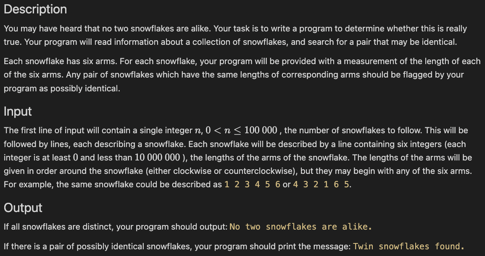

# Links link

## Today's class summary
* definitely definitely finish the snowflake problem the slow way
* use dictionary/hash table/hash map to make a fast solution to the snowflake problem
* Do [compound words](https://drive.google.com/file/d/1Qx_vrkcOu3803fS9zZDjmSJVgvD-ZpVQ/view?usp=sharing)

## Today's class
* Snowflake checklist:
  - `twinsPresent()` using `snowflake_equals`
  - `snowflake_equals` using `snowflake_equals_offset`
  - `snowflake_equals_offset`
  - code that handles user input, calling `twinsPresent`, and output
  - `twinsPresentFast()` which uses a dictionary/hash table/HashMap to bucket snowflakes
  - change the block of code that actually runs things to use `twinsPresentFast()` instead of `twinsPresent`
* Repl: [PyCP0](https://replit.com/team/Algos-Block3-2223/PyCP0) or [JCP0](https://replit.com/team/Algos-Block3-2223/JCP0)

* [Compound Words](https://drive.google.com/file/d/1Qx_vrkcOu3803fS9zZDjmSJVgvD-ZpVQ/view?usp=sharing)
  - Hint: how could you use hashing?

## Extra
* [Puzzles](https://docs.google.com/document/d/1MTP-uutcE8UqrS_ReY1fpH3_UOWqnTOt-C8wUNHJhFo/edit?usp=sharing)

## Resources
* [Course wiki](https://github.com/mrDonoghue/ADS-Block3-2223/wiki)
* [Learn Python in Y Minutes](https://learnxinyminutes.com/docs/python/)
* [Learn Java in Y Minutes](https://learnxinyminutes.com/docs/java/)
* [Anonymous Comment Box](https://forms.gle/yNzRwFg3ZrsuxMpN8)